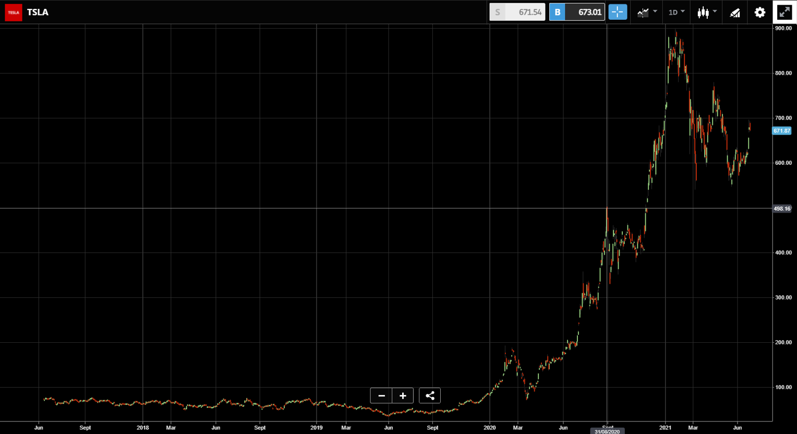

# LSTM-XGBoost-Random Forest Classifier-Kalman Filter

## Contents
- LSTM
- XGBoost
- Random Forest Classifier
## Introduction
>Company Valuation: 700 Bil
Total Float Shares: 775.59 Mil
Total Outstanding Shares: 963.33 Mil
Insider Ownership (Out of Outstanding): 0.12%
Institution Ownership (Out of Outstanding): 59.55%
Avg Trading Vol.: ~ 32 Mil
PE Ration: 673.22
Short Vol.:~40 Mil
Next Earning Date: 08/03/2021
Anomaly: Dark Pool Trading, Option and futures ITMs and OTMs, FTDs timeline.
 
> Another study found out that the radiographs of different viral cases of pneumonia are comparative, and they overlap with other infectious and inflammatory lung diseases, making it hard for radiologists to recognize COVID‐19 from other viral pneumonia cases [[2]](https://pubs.rsna.org/doi/10.1148/rg.2018170048 "Radiographic and CT Features of Viral Pneumonia"). 
> This project aims to make the former study a reality while dealing with the intricacies in the latter, with the help of Deep Learning. 
